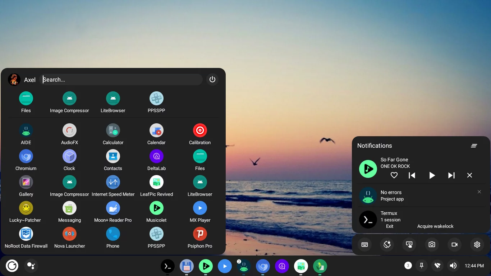

  <h1>Smart Dock</h1>
  A desktop mode launcher for Android

## Usage:
The application should be installed as a system app in order to obtain the right permissions.
Without this functionallity will be limited.

**Hiding Android navigation buttons:**
You should also hide the Android navigation buttons. There are several ways to do this

**With root:**
- From Smart Dock advanced settings
- Edit /system/build.prop and add qemu.hw.mainkeys=1
- Run "echo qemu.hw.mainkeys=1 >> /system/build.prop"

**Without root**
- Mount the system partition on Linux, edit /system/build.prop and add qemu.hw.mainkeys=1  
- For waydroid users, from Linux run waydroid prop set qemu.hw.mainkeys 1

**With LSPosed (might help on Android 11+):**

[See LSPosed](LSPosed.md)

The app uses an accessibility service to capture keyboard input, if that service is crashed you might need to re-enable it and/or restart the system.

## Contributing:

[See contributors](Contributors.md)

If you like the project you can give it a star or consider making a [donation](https://paypal.me/KSMaan7)

## Support:

Telegram support group: https://t.me/smartdock358
