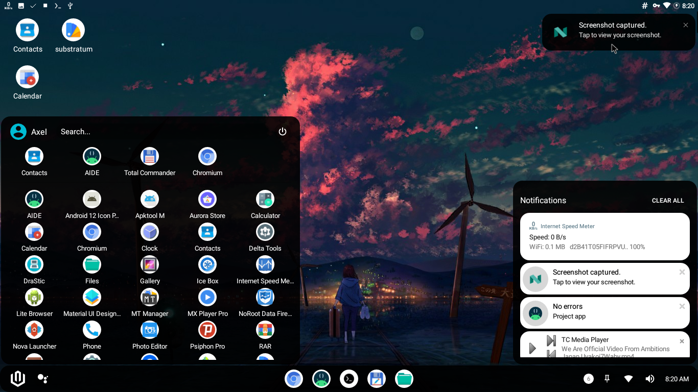

# smartdock
A launcher for Android x86

This project is a launcher for Android x86 to ease user navigation.

Building:
The project itself was created using AIDE on Android x86. To build just clone the project and import it to AIDE.
You might require additional steps to build on Android Studio

To support android versions lower than Pie you must compile against SDK 27

Using:
The application should be installed as a system app in order to obtain the right permissions.
Without this functionallity will be limited.

Hiding Android navigation buttons:
You should also hide the Android navigation buttons. There are several ways to do this

With root:
- From Smart Dock advanced settings
- Edit /system/build.prop and add qemu.hw.mainkeys=1
- Run "echo qemu.hw.mainkeys=1 >> /system/build.prop"

Without root
- Mount the system partition on Linux, edit /system/build.prop and add qemu.hw.mainkeys=1  
- For waydroid users, from Linux run waydroid prop set qemu.hw.mainkeys 1

With LSPosed (might help on Android 11+):

[See LSPosed](LSPosed.md)

The app uses an accessibility service to capture keyboard input, if that service is crashed you might need to re-enable it and/or restart the system.

Contributors:

[See contributors](Contributors.md)

Telegram support group: https://t.me/smartdock358

If you like what we do feel free to donate to the project

https://paypal.me/KSMaan7
