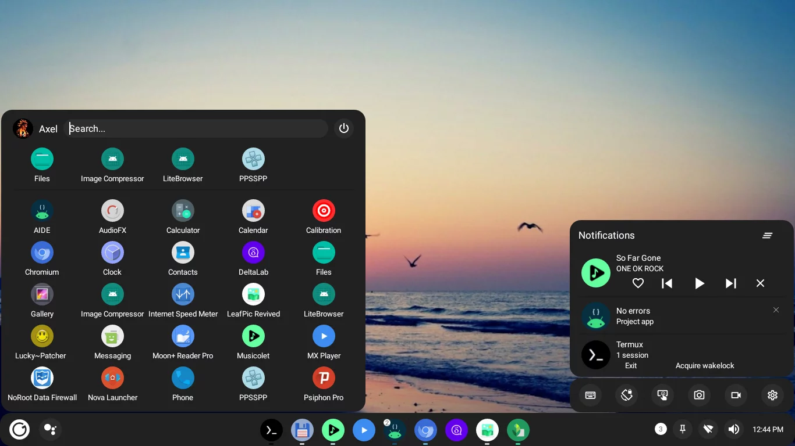

<div align="center">
  <h1>Smart Dock</h1>
  A user-friendly desktop mode launcher that offers a modern and customizable user interface
</div>



## Main features
- Very customizable, icons, colors, shapes, sounds
- Multi window support
- Keyboard shortcuts
- Support for both desktop and tablet layouts
- Compatible with all Android versions since Nougat, no root required

## Install

[](https://f-droid.org/packages/cu.axel.smartdock)

You can grab the latest release from F-Droid

Note: The application should be installed as a system app in order to obtain the right permissions.
Without this functionality will be limited.

## Usage

### Grant restricted permissions: 
On some devices Accessibility and Notification permissions might not be available. To solve this go to:  System Settings > Apps > Smartdock > 3 Dot menu (Top right corner) > Allow restricted permissions

### Secure settings
To grant secure settings permissions run the following command on an adb or root shell:
```
pm grant cu.axel.smartdock android.permission.WRITE_SECURE_SETTINGS
```

### Hide navigation bar
You might also want to hide the Android navigation bar.
[See hiding navigation bar](HideNav.md)

The app uses an accessibility service to capture keyboard input, if that service is crashed you might need to re-enable it and/or restart the system.

## Get help and ask questions 

Telegram support group: https://t.me/smartdock358

## Support the project

If you find this project useful or it has helped you in any way, consider showing your appreciation and supporting its ongoing development. 

Bitcoin Address:
```
bc1qqdxea9mx536a333zwv067uc3pww6pdxz3yat8l
```

Thank you for your support!

## Contributors

[See contributors](Contributors.md)
